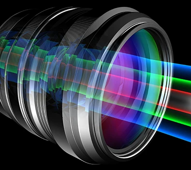
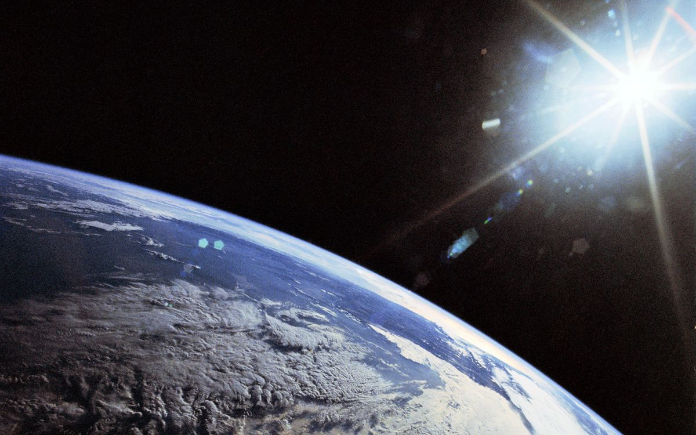
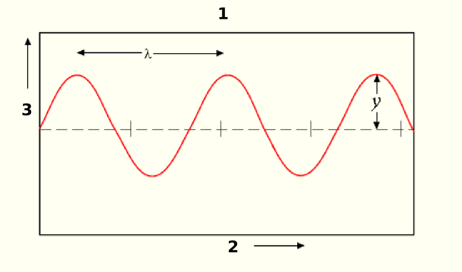
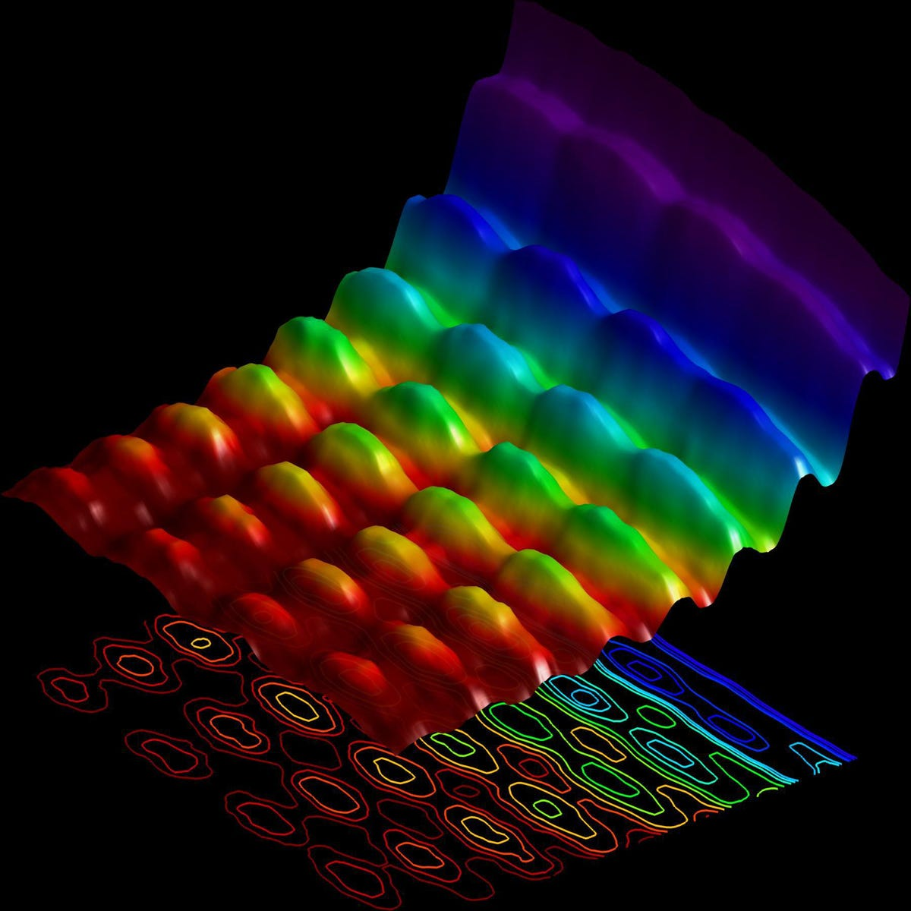
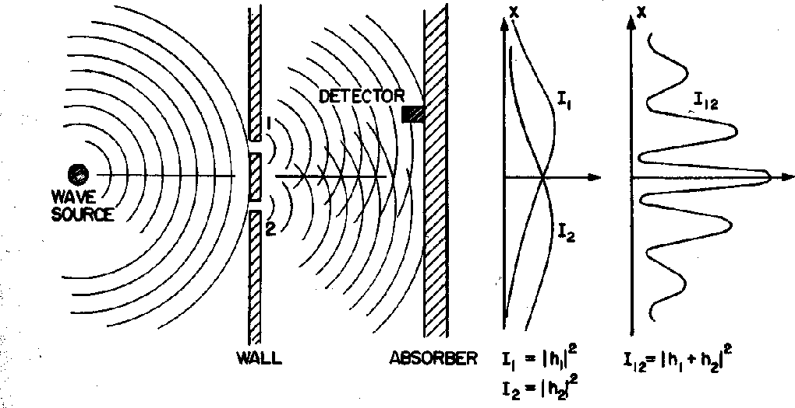
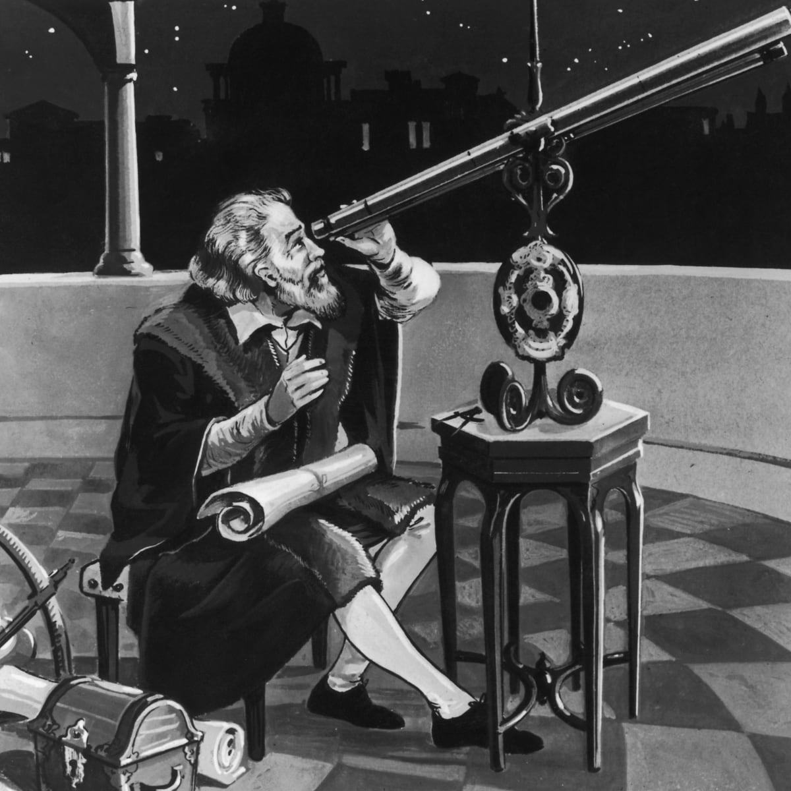
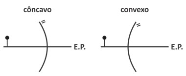

# Sobre o trabalho

# Sobre o trabalho
O código-fonte está disponível por completo no meu repositório do GitHub:  
[https://github.com/takusuman/optica-nov-2021](https://github.com/takusuman/optica-nov-2021)

O trabalho escrito compilado está disponível no meu site:  
[https://pindorama.apocalip.se/~luiz/papers/em/fisica/optica-nov-2021](https://pindorama.apocalip.se/~luiz/papers/em/fisica/optica-nov-2021)

# Agradecimentos
Gostaria de primeiramente agradecer à minha família e ao Senhor por poder
estar aqui hoje, assim como eu queria agradecer ao Profº Leandro Weber por ter
uma excelente didática.  
Adicionalmente, gostaria de agradecer ao meu amigo Marco Tulio, por me ajudar
com a formatação \LaTeX \hspace{0.2cm} da parte escrita e me apresentar ao Pandoc,
ferramenta incrível de código-aberto que usei para fazer esses slides em uma
fração do tempo que eu faria no OpenOffice; também gostaria de agradecer a ele
por ter compilado o trabalho escrito para mim na máquina dele, já que, por algum
motivo, a minha estava quebrando a capa.

# Introdução

# O que é a óptica?

# O que é a luz?

# Só para lembrar: ondas, a definição

# Só para lembrar: ondas, meios de propagação

# Só para lembrar: ondas, direções de propagação 

# Só para lembrar: ondas, fenômenos

# O que é um telescópio?

# O que são lentes?

# Espelhos: O Côncavo e o Convexo

# p/ vc <3

**1.** (UFAM) O espelho de aumento é um acessório muito usado em óticas com o
objetivo de auxiliar os clientes na escolha do modelo de seus óculos. Considere
a situação na qual certa jovem usa um espelho de aumento com raio de curvatura
de 50 cm para se maquiar. Se o espelho forma a imagem do rosto da jovem ampliada
em 150%, podemos afirmar que a distância em centímetros entre o rosto da jovem e
o vértice do espelho é:  
**a) 40**  
**b) 30**  
**c) 25**  
**d) 20**  
**e) 15**

# p/ vc <3

**2.** Dois espelhos planos fornecem 11 imagens de um objeto. Podemos concluir
que os espelhos formam um ângulo igual a:  
**a) 10º**  
**b) 25º**  
**c) 30º**  
**d) 60º**  
**e) 45º**

# p/vc <3

**3.** (MACKENZIE-SP) Um objeto real se encontra sobre o eixo principal de um
espelho côncavo, de distância focal 10 cm, e a 20 cm do vértice do espelho.
Sendo obedecidas as condições de Gauss, sua imagem é:  
**a) real e direta.**  
**b) real e invertida.**  
**c) virtual e direta.**  
**d) virtual e invertida.**  
**e) imprópria, localizada no infinito.**  
